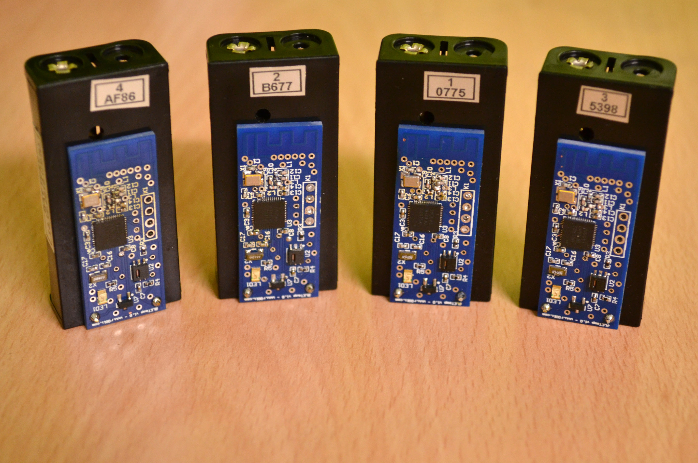
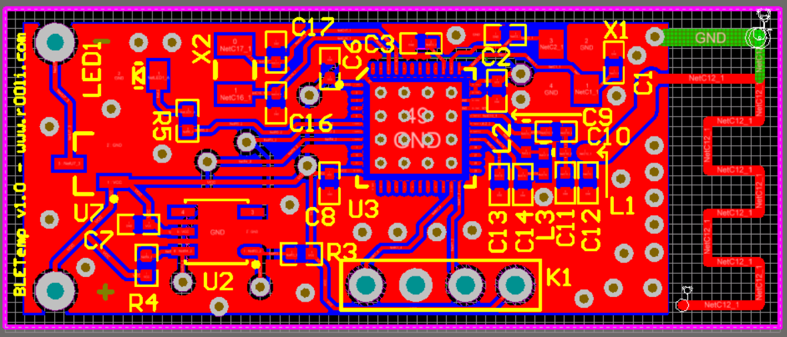
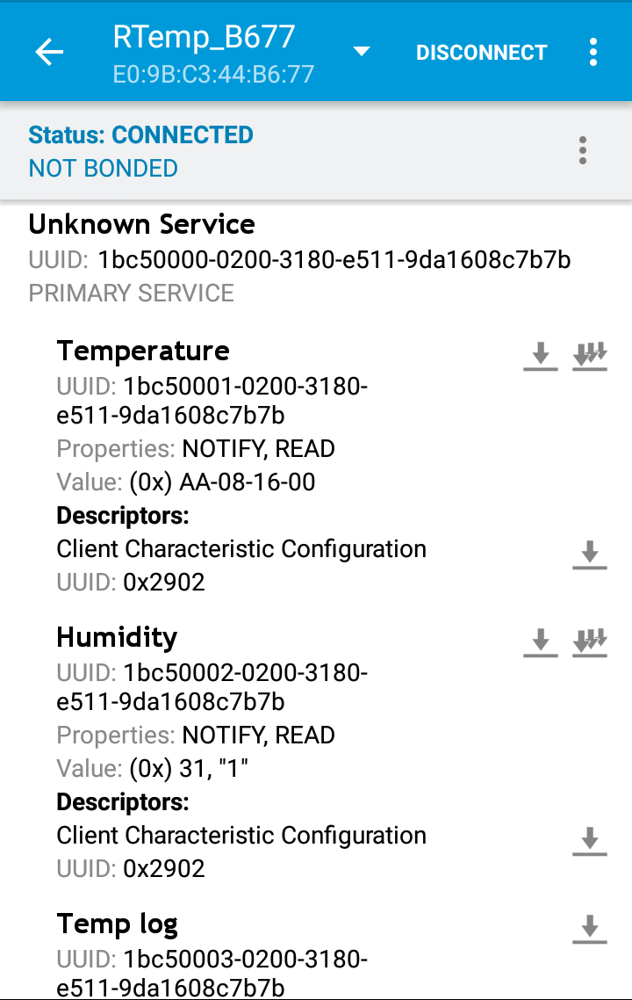
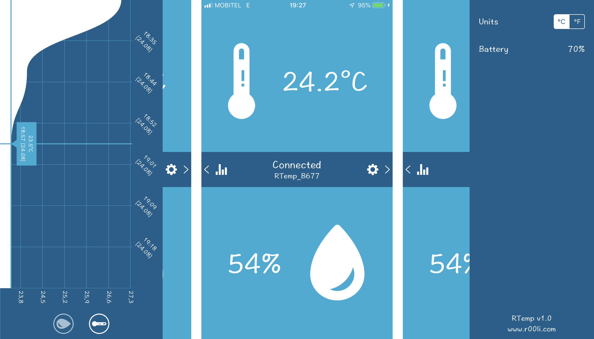

# RTemp

**A Bluetooth Low energy temperature and humidity sensor and logger.**

## What is it?

This is a simple battery operated (2xAAA) temperature/humidity sensor and logger. It is based on the Nordic nrf51822 BLE SoC. It uses Sensirion SHT21 temperature and humidity sensor. This means that it should have about 0.1°C temperature accuracy when placed into a normal room. It is however not designed to be placed outside for extended periods of time (or in rain) and it's accuracy will drop when it gets too hot or too cold. For more details see the temperature sensor datasheet.

It is designed to either be used standalone with a phone, or integrated into a home automation system.

The logger is designed to store both temperature and humidity measurements. A measurement every 15 minutes and will store 254 measurements. This should roughly translate into about 2.5 days log size. Due to space considerations only 0.5°C accuracy is used for storage and the lowest and highest temperature ranges that can be stored are limited to about +/-64°C. Also the actual time and date are not stored with the measurement, so some estimation needs to be done on the client side (which means that time accuracy is basically +/-15 minutes).

## Building one yourself

### Hardware

The hardware itself is really simple. It uses a Nordic nrf51822 BLE SoC and is paired with the Sensirion SHT21 temperature sensor. The rest are just some standard capacitors, inductors and similar stuff. It doesn't use any premade modules or anything like that. The whole RF side is done on this board itself. All of the components can be soldered together at home without any special tools (besides a temperature controlled soldering iron and some flux). Although I do recommend a hot air gun. But do note that small 0402 sized components are used, so you will need some practice. 

To build one yourself you will need the PCB. The PCB is most likely too complex to be done at home, so you can simply use the gerbers included in this project and send them off to your favorite PCB place.

You will of course also need all of the needed components. A complete BOM (includes the picture of the board and schematic) is located in the BOM.pdf file in the project. Links to the components themselves are also included.

If you want to modify the PCB before making it, the source files are also included. The board was designed using Altium Designer (version 15 if I remember correctly). I usually use other tools, but this started as a student project and I had a license for it at the time.

### Firmware

Firmware was built with the official Nordic SDK and is written in C. This does not use ARM Mbed or anything like that. 

To upload the firmware to the board you will need a suitable ARM SWD programmer (Segger JLink), an STM32 dev board (any that includes STLink should work) or a standalone STLink USB programmer (found on ebay for around 5$).

Precompiled firmware hex file is included in the project. Before you upload the firmware hex file you need to upload Nordic's nrf51 S110 BLE softdevice (v 8.0.0) found here: 

Upload the softdevice first, followed by the firmware. To upload it you can either use an ARM Ide (ARM Keil for example) or an open source command line tool called OpenOCD.

If you want to modify the firmware you will also need a Nordic nrf51 SDK version 9.0.0 found here:

This was made using ARM Keil IDE (free code size limited version is ok). If you want to modify the firmware download the SDK and unzip it, then copy the folder inside the `Firmware project` folder of this project to the `Unzipped SDK/examples/PROJEKTI/` (You will need to make the PROJEKTI folder). After that navigate to the `BLE_Temp/pca10028/s110/arm5_no_packs` folder and open the `nrf51-ble-tutorial-service.uvprojx` with the Keil IDE. 

### Usage and BLE protocol

If you've built everything correctly and uploaded the firmware, pop in the batteries and the device should come to life. You should see the status LED flash, then turn off. After that you should be able to discover and connect to the device using a standard BLE explorer (I recommend Nordic nrf connect - available for both Android and iOS). 

Device implements a single custom service (image shows the details) with 4 characteristics - Temperature, Humidity, Temperature Log, Humidity Log.

Temperature is 4 bytes long in the following format:
`AA-<decimal value>-<temperature value>-<sign>`
Everything should be interpreted as an unsigned HEX value. AA is just a marker so that you know the correct order.
If the sign value is 0 it means that the value is positive, else negative.
So if you combine everything you should get: `<sign><temp.value>.<decimal>`.

Humidity is a single byte value and is humidity value in %.

Temperature log consists of 255 bytes. First byte indicates the current index in the circular buffer. The rest are temperature values in a circular buffer. Values not yet filled are marked with 0xFF. For example:
`<Index>-<Value 1>-<Value 2>-<Value 3>-<FF>-<FF>-...`
First bit indicates the sign (0 means +, 1 means -), second bit indicates that you should add 0.5 to the value (0 means don't add anything, 1 means add 0.5). The rest of the bits are int temperature value. 

Humidity log is identical to the temperature log, except that the values indicate the int humidity value in % directly. So no need for any conversion. 

Standard BLE Battery characteristic is also used for the battery level. Temperature and Humidity characteristic also support BLE notifications so you can be notified when the values change. Logs will need polling.

If you need an example take a look at the iOS example project `BLEPeripheralManager.swift` file is doing all of the protocol decoding needed.

## iOS App

I've also made an iOS app for this - the source is included in the project. Please note that this was made years ago when I was still learning CoreBluetooth. I've recently updated it to work with iPhone X style devices and upgraded the project to Swift 5. The whole thing is a bit buggy still, and switching between temperature units was never implemented. But it is a good starting point. It is a standard iOS project with Cocoapods. It should be simple for you to get started. 

## Help and support

If you need help with anything contact me either through github (open an issue here), or through Hackaday.io <link> . You can also check my website: http://www.r00li.com .

## License

This project is Licensed using GNU GPL Version 3. See LICENSE for more details.
